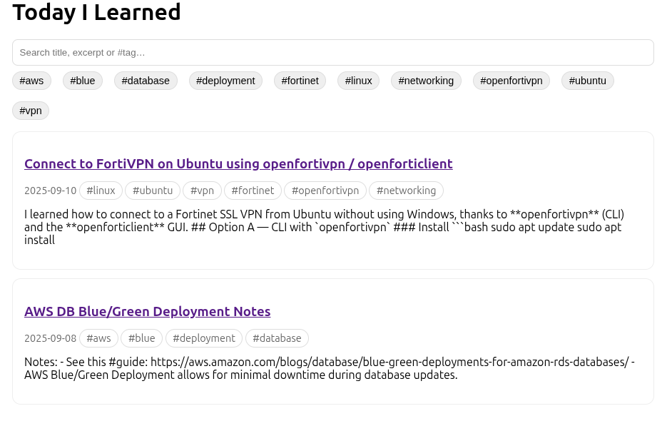

## Today I Learned (TIL)

This is a basic "Today I Learned" (TIL) site. Notes are organized by topic in the `content/` directory (e.g., `aws/`, `linux/`).

The site is built from the `app/` directory and published automatically using GitHub Actions whenever changes are pushed to the repository.

The built site is then deployed to GitHub Pages, making it accessible at `https://<username>.github.io/<repo>/`.

## Features

- **Search**: Quickly find notes by title, excerpt, or tags.
- **Tags**: Filter notes by tags for easier navigation.

# Screenshot

---
*Powered by automation and curiosity.*
